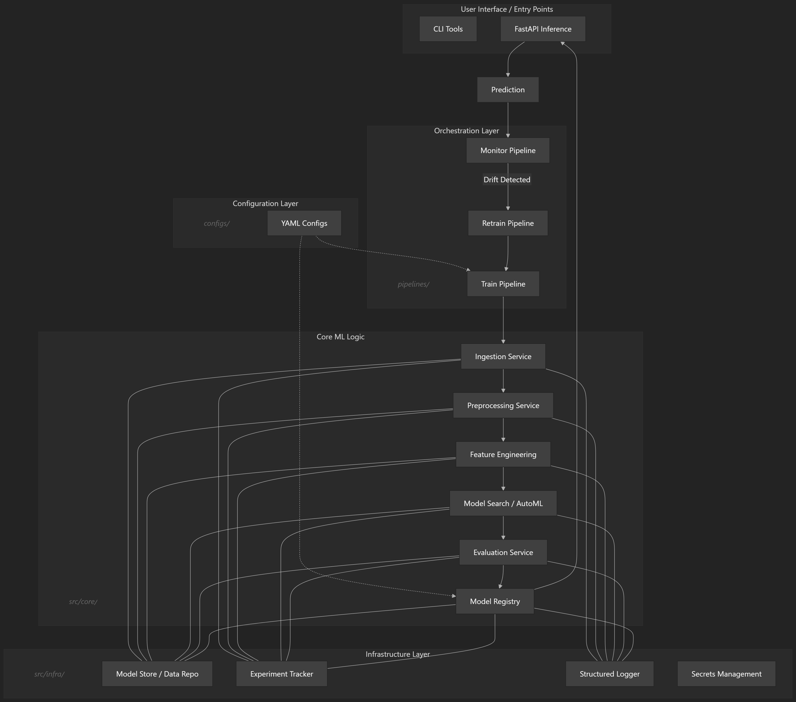
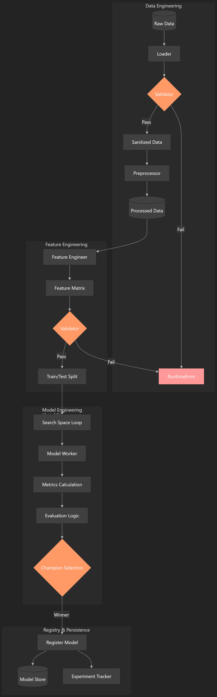
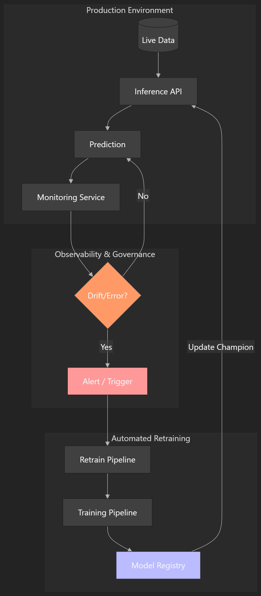

# **Modular AutoML Energy Forecasting System**


A fully modular, configuration‑driven MLOps framework for **energy‑consumption forecasting**, built around strict engineering laws that eliminate hidden technical debt and enforce reproducibility, portability, and maintainability.

This project treats Machine Learning as a **software system**, not a script — using a service‑oriented architecture, dependency injection, validation gates, metadata tracking, and a versioned model registry.

---

## **🚀 Project Overview**

This system is designed to solve real‑world ML engineering problems:

- brittle pipelines  
- hidden coupling  
- silent data failures  
- unreproducible training  
- unversioned models  
- unclear orchestration  

The solution is a **clean, layered architecture** with:

- deterministic artifact paths  
- strict data contracts  
- versioned model registry  
- pipeline metadata tracking  
- config snapshotting  
- modular services  
- a dedicated training orchestrator  

---

## **🎯 Core Engineering Laws**

The entire project adheres to five architectural laws:

1. **Zero Hardcoding**  
   All paths, hyperparameters, schemas, and settings come from YAML config files.

2. **Config‑Driven Architecture**  
   A singleton config loader provides a consistent, environment‑aware configuration object.

3. **Portability First**  
   All paths use `pathlib` and resolve relative to the project root.

4. **Decoupled Logic**  
   Data engineering, model engineering, and orchestration are isolated into independent services.

5. **Dependency Injection Everywhere**  
   The orchestrator receives all services explicitly — no hidden state, no global objects.

---

## **🏗 System Architecture**

The project is organized into five layers:

```
┌──────────────────────────────┐
│        Pipeline Layer        │  ← train_pipeline.py (entrypoint)
└──────────────────────────────┘
┌──────────────────────────────┐
│       Orchestration Layer    │  ← TrainingOrchestrator
└──────────────────────────────┘
┌──────────────────────────────┐
│         Service Layer        │  ← ingestion, preprocessing, engineering, splitting, modeling, evaluation
└──────────────────────────────┘
┌──────────────────────────────┐
│     Infrastructure Layer     │  ← artifact manager, repository, logging
└──────────────────────────────┘
┌──────────────────────────────┐
│        Configuration Layer   │  ← YAML configs + singleton loader
└──────────────────────────────┘
```
### 1. High‑Level System Architecture (Layers)

This diagram represents the **System Topology**. It separates the "Core" (ML Logic) from the "Infra" (Utilities) and "Orchestration" (Execution), ensuring that the ML logic is decoupled from the underlying infrastructure.



<details>
<summary>View Architecture Logic (Mermaid Code)</summary>

```text

graph TD

    subgraph UI["User Interface / Entry Points"]
        CLI[CLI Tools]
        API[FastAPI Inference]
    end

    subgraph ORCH["Orchestration Layer"]
        TrainPipe[Train Pipeline]
        RetrainPipe[Retrain Pipeline]
        MonitorPipe[Monitor Pipeline]
    end

    subgraph CORE["Core ML Logic"]
        Ingestion[Ingestion Service]
        Preprocessing[Preprocessing Service]
        Features[Feature Engineering]
        Search[Model Search / AutoML]
        Eval[Evaluation Service]
        Registry[Model Registry]
    end

    subgraph INFRA["Infrastructure Layer"]
        Storage[Model Store & Data Repo]
        Tracker[Experiment Tracker]
        Logger[Structured Logger]
        Secrets[Secrets Management]
    end

    subgraph CONFIG["Configuration Layer"]
        Config[YAML Configs]
    end

    Config -.-> TrainPipe
    Config -.-> Registry
    
    TrainPipe --> Ingestion
    Ingestion --> Preprocessing
    Preprocessing --> Features
    Features --> Search
    Search --> Eval
    Eval --> Registry
    
    Registry --> API
    API --> Prediction[Prediction]
    Prediction --> MonitorPipe
    MonitorPipe -- "Drift Detected" --> RetrainPipe
    RetrainPipe --> TrainPipe

    Ingestion --- Storage
    Preprocessing --- Storage
    Features --- Storage
    Search --- Storage
    Eval --- Storage
    Registry --- Storage

    Ingestion --- Tracker
    Preprocessing --- Tracker
    Features --- Tracker
    Search --- Tracker
    Eval --- Tracker
    Registry --- Tracker

    Ingestion --- Logger
    Preprocessing --- Logger
    Features --- Logger
    Search --- Logger
    Eval --- Logger
    Registry --- Logger
```

</details>

---

### 2. The Training Pipeline (Data Flow)

This diagram illustrates the **Worker Pattern** and **Data Flow**. It highlights the "Fail-Fast" principle via **Validation Gates**, ensuring that data integrity is verified at every transition point between Data Engineering and ML Engineering.



<details>
<summary>View Training Pipeline (Mermaid Code)</summary>

```text

flowchart TD

subgraph DE["Data Engineering"]
    RawData[(Raw Data)] --> Load[Loader]
    Load --> Val1{Validator}
    Val1 -- Fail --> Error[RuntimeError]
    Val1 -- Pass --> Sanitized[Sanitized Data]
    Sanitized --> Pre[Preprocessor]
    Pre --> Processed[(Processed Data)]
end

subgraph FE["Feature Engineering"]
    Processed --> Feat[Feature Engineer]
    Feat --> Matrix[Feature Matrix]
    Matrix --> Val2{Validator}
    Val2 -- Fail --> Error
    Val2 -- Pass --> Split[Train/Test Split]
end

subgraph ME["Model Engineering (AutoML)"]
    Split --> Search[Search Space Loop]
    Search --> Train[Model Worker]
    Train --> Metrics[Metrics Calculation]
    Metrics --> Eval[Evaluation Logic]
    Eval --> Champion{Champion Selection}
end

subgraph RP["Registry & Persistence"]
    Champion -- "Winner" --> Reg[Register Model]
    Reg --> Store[(Model Store)]
    Reg --> Tracker[Experiment Tracker]
end

style Val1 fill:#f96,stroke:#333
style Val2 fill:#f96,stroke:#333
style Champion fill:#f96,stroke:#333
style Error fill:#ff9999
```

</details>

---

### 3. The Production Feedback Loop (MLOps Cycle)

This diagram demonstrates the **Observability & Automation** lifecycle. It shows how the system behaves in production, where the **Model Registry** acts as the "Single Source of Truth" to trigger automated retraining based on live drift signals.



<details>
<summary>View Production Feedback Loop (Mermaid Code)</summary>

```text

graph TD

    subgraph PROD["Production Environment"]
        LiveData[(Live Data)] --> API[Inference API]
        API --> Prediction[Prediction]
        Prediction --> Monitor[Monitoring Service]
    end

    subgraph OBS["Observability & Governance"]
        Monitor --> Drift{Drift / Error?}
        Drift -- No --> Prediction
        Drift -- Yes --> Alert[Alert / Trigger]
    end

    subgraph AUTO["Automated Retraining"]
        Alert --> RetrainPipe[Retrain Pipeline]
        RetrainPipe --> TrainPipe[Training Pipeline]
        TrainPipe --> Registry[Model Registry]
        Registry -- "Update Champion" --> API
    end

    style Drift fill:#f96,stroke:#333
    style Alert fill:#ff9999
    style Registry fill:#bbf,stroke:#333
```

</details>

### **Key Architectural Highlights**

- **Registry as the Source of Truth**  
  The inference API will load the *champion model* exclusively from the registry.

- **Validation Gates**  
  Every pipeline stage enforces a schema contract to prevent silent data corruption.

- **Worker Pattern**  
  The orchestrator does not train models directly — it delegates to a Model Worker.

- **Deterministic Metadata**  
  Every pipeline run produces a metadata file containing timestamps, durations, artifact paths, and registry version.

---

## **🛠 Tech Stack**

- **Language:** Python 3.9+  
- **ML Framework:** Scikit‑Learn  
- **Orchestration:** Custom Training Orchestrator  
- **Logging:** Loguru  
- **Configuration:** YAML + Dataclasses  
- **Data Handling:** Pandas, NumPy  
- **API (Planned):** FastAPI  
- **Deployment (Planned):** Docker  

---

## **📈 Project Milestones & Roadmap**

### **✅ Completed**

- [x] Singleton configuration loader  
- [x] Service‑oriented architecture  
- [x] Data validation contracts  
- [x] Model Worker Factory  
- [x] Modular training pipeline  
- [x] Structured logging with run_id  
- [x] **Training Orchestrator** (new)  
- [x] **Pipeline Metadata System** (new)  
- [x] **Config Snapshotting** (new)  
- [x] **Model Registry with versioning + champion pointer** (new)  

### **🧭 In Progress / Planned**

- [ ] Drift monitoring service  
- [ ] Automated retraining pipeline  
- [ ] FastAPI deployment  
- [ ] Dockerization  
- [ ] Model comparison engine  

---

## **💻 Getting Started**

### **Prerequisites**

- Python 3.9+  
- Virtual environment (`venv` recommended)

### **Installation**

```bash
git clone https://github.com/steady-uptime/energy_forecasting
cd energy_forecasting
pip install -r requirements.txt
```

### **Run the Training Pipeline**

```bash
python -m pipelines.train_pipeline
```

This will:

- ingest raw data  
- preprocess  
- engineer features  
- split  
- train  
- evaluate  
- register the model  
- generate metadata  
- snapshot the config  

---

## **📂 Directory Structure**

```
.
├── configs/                # YAML configuration files
├── data/                   # Raw, processed, engineered data
├── logs/                   # Structured pipeline logs
├── artifacts/              # Models, metrics, registry, metadata
├── pipelines/              # Pipeline entrypoints (train, retrain, etc.)
├── src/
│   ├── core/               # Orchestrator, services, registry, metadata
│   ├── infra/              # Artifact manager, repository, logging
│   └── utils/              # Helpers
└── requirements.txt
```

---

## **⚖️ Legal & Compliance**

This project uses the **Electricity Load Diagrams 2011–2014** dataset from the UCI Machine Learning Repository, licensed under **CC BY 4.0**.
