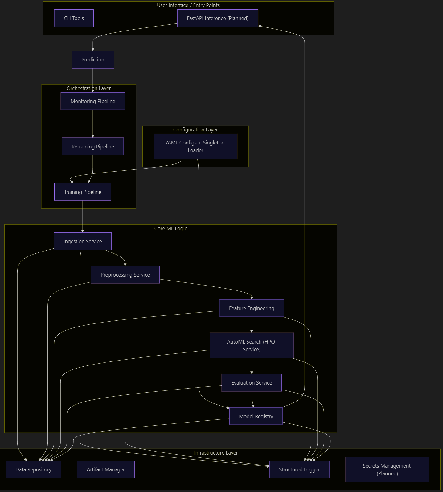
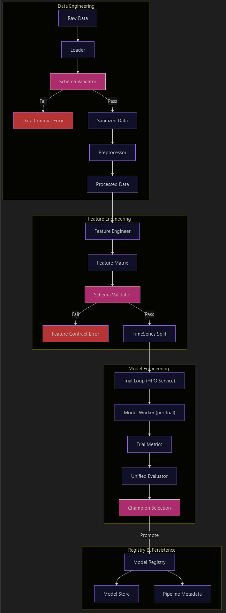
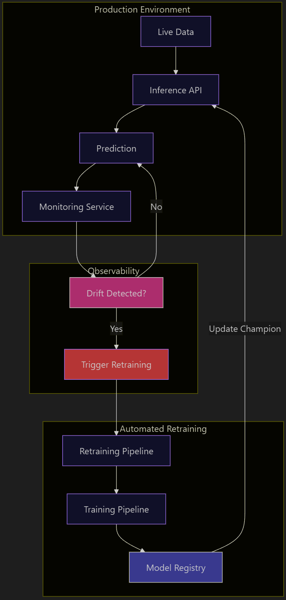

# **Enterprise-Ready MLOps Framework for Energy Forecasting**


A modular, configuration-driven MLOps framework designed to manage the full lifecycle of energy-consumption forecasting. This project treats Machine Learning as a **modular, service-oriented, pipeline-drive, production-grade system**, enforcing strict architectural patterns to eliminate technical debt, ensure 100% reproducibility, and provide "plug-and-play" portability across environments.

## **🏗 Architectural Philosophy**
This system is built on the principle of **Decoupled Engineering**. It separates the *What* (ML Logic) from the *How* (Infrastructure) and the *When* (Orchestration).

### **Core Engineering Laws:**
1.  **Zero Hardcoding:** 100% configuration-driven. All hyperparameters, paths, and schemas reside in YAML.
2.  **Dependency Injection (DI):** Services (Ingestion, Modeling, etc.) are injected into Orchestrators, allowing for easy mocking during unit testing and seamless swapping of components.
3.  **Deterministic Artifact Lineage:** Every trial and pipeline run produces a unique `run_id`, mapping specific configurations to specific model weights and metadata.
4.  **Contract Validation:** Every module transition is guarded by a schema validator to prevent "silent failures" in the data pipeline.
5.  **Singleton Configuration:** A centralized, environment-aware configuration loader ensures a single source of truth for the entire application state.

---

## **🏗 System Architecture**

The project is organized into five layers:

```
┌──────────────────────────────┐
│        Pipeline Layer        │  ← train_pipeline.py (entrypoint)
└──────────────────────────────┘
┌──────────────────────────────┐
│       Orchestration Layer    │  ← TrainingOrchestrator
└──────────────────────────────┘
┌──────────────────────────────┐
│         Service Layer        │  ← ingestion, preprocessing, engineering, splitting, modeling, evaluation
└──────────────────────────────┘
┌──────────────────────────────┐
│     Infrastructure Layer     │  ← artifact manager, repository, logging
└──────────────────────────────┘
┌──────────────────────────────┐
│        Configuration Layer   │  ← YAML configs + singleton loader
└──────────────────────────────┘
```
### 1. High-Level System Architecture (Layers)

This diagram presents the System Topology, showing how the project is structured into five layers: Pipeline, Orchestration, Core ML Logic, Infrastructure, and Configuration. It illustrates the full execution path—from ingestion and preprocessing through feature engineering, AutoML, evaluation, and model registration—while also showing how production inference, monitoring, and retraining feed back into the training pipeline. Infrastructure components such as the data repository, artifact manager, and structured logging support each service, resulting in a fully decoupled, service‑oriented architecture where ML logic remains isolated from orchestration and infrastructure.



<details>
<summary>View Architecture Logic (Mermaid Code)</summary>

```text
graph TD

    subgraph UI["User Interface / Entry Points"]
        CLI["CLI Tools"]
        API["FastAPI Inference (Planned)"]
    end

    subgraph ORCH["Orchestration Layer"]
        TrainPipe["Training Pipeline"]
        RetrainPipe["Retraining Pipeline"]
        MonitorPipe["Monitoring Pipeline"]
    end

    subgraph CORE["Core ML Logic"]
        Ingestion["Ingestion Service"]
        Preprocessing["Preprocessing Service"]
        Features["Feature Engineering"]
        AutoML["AutoML Search (HPO Service)"]
        Eval["Evaluation Service"]
        Registry["Model Registry"]
    end

    subgraph INFRA["Infrastructure Layer"]
        Repo["Data Repository"]
        Artifacts["Artifact Manager"]
        Logger["Structured Logger"]
        Secrets["Secrets Management (Planned)"]
    end

    subgraph CONFIG["Configuration Layer"]
        Config["YAML Configs + Singleton Loader"]
    end

    %% Config wiring
    Config --> TrainPipe
    Config --> Registry

    %% Pipeline flow
    TrainPipe --> Ingestion
    Ingestion --> Preprocessing
    Preprocessing --> Features
    Features --> AutoML
    AutoML --> Eval
    Eval --> Registry

    %% Production flow
    Registry --> API
    API --> Prediction["Prediction"]
    Prediction --> MonitorPipe
    MonitorPipe --> RetrainPipe
    RetrainPipe --> TrainPipe

    %% Infra connections
    Ingestion --- Repo
    Preprocessing --- Repo
    Features --- Repo
    AutoML --- Repo
    Eval --- Repo
    Registry --- Repo

    Ingestion --- Logger
    Preprocessing --- Logger
    Features --- Logger
    AutoML --- Logger
    Eval --- Logger
    Registry --- Logger
```

</details>

---

### 2. AutoML / Model Search Pipeline (Trial-Level Lineage)**

This pipeline transforms raw energy-consumption data into a fully evaluated, registry-ready model. It moves through four stages:

Data Engineering — Raw data is loaded, validated, sanitized, and preprocessed to enforce strict schema contracts.

Feature Engineering — Deterministic feature generation and a second validation gate ensure clean, time-series-ready feature matrices.

AutoML Trials — The HPO Service runs multiple model trials, each producing its own metrics and artifacts. A unified evaluator selects the best-performing trial.

Registry Promotion — The chosen Champion model is promoted to the Model Registry with full lineage, metadata, and reproducible artifacts.

This diagram represents the complete flow from raw data to Champion model selection, ensuring reproducibility, contract-driven quality, and trial-level governance. 



<details>
<summary>View Training Pipeline (Mermaid Code)</summary>

```text
graph TD

    %% -------------------------
    %% Data Engineering
    %% -------------------------
    subgraph DE["Data Engineering"]
        RawData["Raw Data"] --> Loader["Loader"]
        Loader --> SchemaVal1["Schema Validator"]
        SchemaVal1 -->|Fail| DataErr["Data Contract Error"]
        SchemaVal1 -->|Pass| SanitizedData["Sanitized Data"]
        SanitizedData --> Preprocessor["Preprocessor"]
        Preprocessor --> ProcessedData["Processed Data"]
    end

    %% -------------------------
    %% Feature Engineering
    %% -------------------------
    subgraph FE["Feature Engineering"]
        ProcessedData --> FeatureEng["Feature Engineer"]
        FeatureEng --> FeatureMatrix["Feature Matrix"]
        FeatureMatrix --> SchemaVal2["Schema Validator"]
        SchemaVal2 -->|Fail| FeatureErr["Feature Contract Error"]
        SchemaVal2 -->|Pass| TimeSplit["TimeSeries Split"]
    end

    %% -------------------------
    %% Model Engineering / AutoML
    %% -------------------------
    subgraph ME["Model Engineering (AutoML Trials)"]
        TimeSplit --> TrialLoop["Trial Loop (HPO Service)"]
        TrialLoop --> TrialWorker["Model Worker (per trial)"]
        TrialWorker --> TrialMetrics["Trial Metrics"]
        TrialMetrics --> UnifiedEval["Unified Evaluator"]
        UnifiedEval --> ChampionSelect["Champion Selection"]
    end

    %% -------------------------
    %% Registry & Persistence
    %% -------------------------
    subgraph RP["Registry & Persistence"]
        ChampionSelect -->|Promote| Registry["Model Registry"]
        Registry --> ModelStore["Model Store"]
        Registry --> PipelineMeta["Pipeline Metadata"]
    end

    %% -------------------------
    %% Styling
    %% -------------------------
    style SchemaVal1 fill:#f9c,stroke:#333
    style SchemaVal2 fill:#f9c,stroke:#333
    style ChampionSelect fill:#f9c,stroke:#333
    style DataErr fill:#ff9999
    style FeatureErr fill:#ff9999

```

</details>

---

### 3. The Production Feedback Loop (MLOps Cycle)

This diagram shows how the system operates in production. Live data flows through the Inference API, generating predictions that are continuously monitored for drift. When drift is detected, the system triggers the Retraining Pipeline, which produces a new model and updates the Champion in the Model Registry. This creates a closed‑loop cycle where the production model is automatically refreshed based on real‑world behavior.



<details>
<summary>View Production Feedback Loop (Mermaid Code)</summary>

```text
graph TD

    subgraph PROD["Production Environment"]
        Live["Live Data"] --> API["Inference API"]
        API --> Pred["Prediction"]
        Pred --> Monitor["Monitoring Service"]
    end

    subgraph OBS["Observability"]
        Monitor --> Drift["Drift Detected?"]
        Drift -->|No| Pred
        Drift -->|Yes| Alert["Trigger Retraining"]
    end

    subgraph AUTO["Automated Retraining"]
        Alert --> Retrain["Retraining Pipeline"]
        Retrain --> Train["Training Pipeline"]
        Train --> Registry["Model Registry"]
        Registry -->|Update Champion| API
    end

    style Drift fill:#f9c,stroke:#333
    style Alert fill:#ff9999
    style Registry fill:#bbf,stroke:#333
```

</details>

---

## **🛠 Technical Specifications**

-   **Language:** Python 3.9+ (Type Hinted)
-   **ML Framework:** Scikit-Learn, NumPy, Pandas
-   **Orchestration:** Custom Training Orchestrator (Worker Pattern)
-   **Logging:** Structured logging via `loguru` (Context-aware `run_id`)
-   **Configuration:** YAML + Dataclasses (Singleton Loader)
-   **Data Validation:** Custom Schema Validator
-   **Architecture:** Cloud-Ready (Azure ML Compatible)

---

## **📈 Project Milestones & Capabilities**

### **🏗️ System Architecture & Engineering**
- [x] **Service-Oriented Architecture:** Full decoupling of ML logic into independent, testable modules with strict input/output contracts.
- [x] **Production-Grade Dependency Injection:** Services are injected into Orchestrators via constructors to ensure loose coupling and high testability.
- [x] **Singleton Configuration Management:** Centralized configuration with environment variable overrides and global state consistency.
- [x] **Data Validation Contracts:** Enforced schema verification at every stage (Raw → Sanitized → Engineered) using a centralized validator.
- [x] **Portability-First Design:** Zero hardcoding; all paths and resources are dynamically resolved via a project-root-aware configuration loader.

### **🗄️ Data Engineering & Orchestration**
- [x] **DataOrchestrator Pattern:** Consolidated ingestion, preprocessing, and feature engineering into a single, atomic data engineering lifecycle.
- [x] **Idempotent Data Pipelines:** Designed to handle batch processing with immutable read-only data repositories.
- [x] **TimeSeries-Aware Splitting:** Custom logic for handling temporal dependencies in energy consumption data.

### **🤖 Model Lifecycle & Governance**
- [x] **Model Worker Factory:** Abstracted model instantiation to support multi-model experimentation and easy scaling.
- [x] **Model Registry & Versioning:** Deterministic artifact paths, versioned registry entries, champion pointer, and full trial/pipeline lineage.
- [x] **Configuration Snapshotting:** Automatic persistence of the exact hyperparameter and configuration state for every production run.
- [x] **Pipeline Metadata System:** Structured JSON tracking of execution status, phase durations, and artifact paths.

### **👁️ Observability & Quality Assurance**
- [x] **Structured Logging:** Contextual logging with unique `run_id` tracking across all services.
- [x] **Drift Detection Pipeline:** Automated monitoring for data and concept drift.
- [x] **Automated Reporting:** Generation of drift thresholds and performance summaries.

---

## **💻 Execution Guide**

### **Installation**
```bash
git clone https://github.com/steady-uptime/energy_forecasting
cd energy_forecasting
pip install -r requirements.txt
```

### **Running the Pipeline**
We use the **Module Execution Pattern** to ensure correct `PYTHONPATH` resolution:
```bash
python -m pipelines.train_pipeline
```
*This triggers the Bootstrap Loader, which initializes the Singleton Config, wires the injected services, and executes the Orchestrator.*

---

## **📂 Directory Structure**
```text
.
├── configs/                # YAML configuration files
├── artifacts/             # Versioned models, metrics, and reports
├── logs/                  # Structured logs with unique run_ids
├── pipelines/            # Pipeline entrypoints (train, retrain, etc.)
├── src/
│   ├── core/             # Orchestrator, services, registry, metadata
│   ├── infra/           # Artifact manager, repository, logging, secrets
│   └── utils/           # Helpers (Validators, Path Utilities)
└── requirements.txt
```

---
*This project was developed as a demonstration of high-level MLOps engineering principles, moving beyond "Notebook ML" into production-grade software systems.*
---

## **⚖️ Legal & Compliance**

This project uses the **Electricity Load Diagrams 2011–2014** dataset from the UCI Machine Learning Repository, licensed under **CC BY 4.0**.
